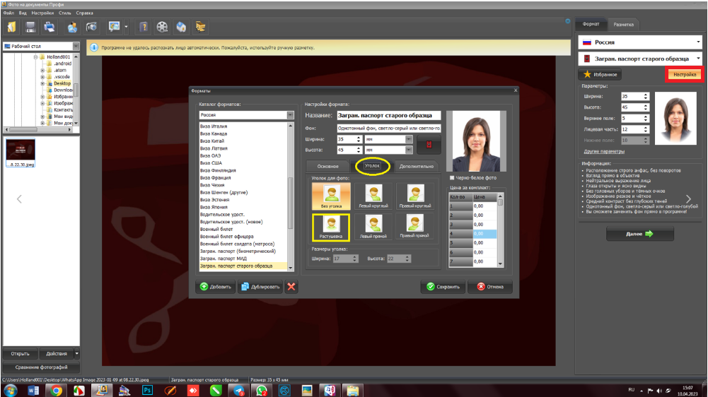

# ⚙️ Настройки параметров

В случае необходимости сделать фото ч/б или угл - необходимо зайти:

* Настройки
* Уголок

Выбрать нужный вам вариант и цвет фотографии.

<figure><figcaption></figcaption></figure>
