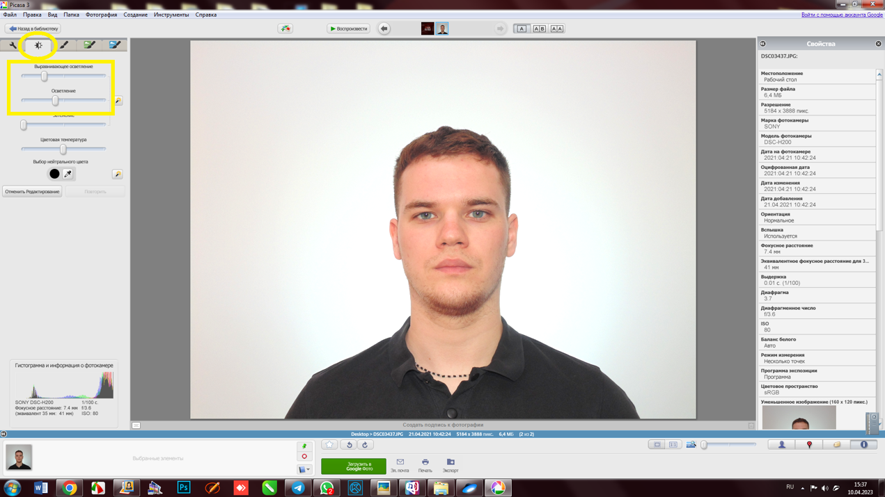

# 🎞️ Обработка фото

Переходим к обработке фото. Как ты уже знаешь, фотографию перед печатью НЕОБХОДИМО осветлить, так как Epson затемняет изображение при печати. В качестве совета, рекомендую осветлять перед самой обработкой в приложении ФНД, и тому есть несколько причин:

* Ты элементарно не забудешь про осветление, так как начнешь обработку фото с него.
* Заранее осветленную фотографию проще обрабатывать и заменять фон, что позволит тебе сократить время услуги.

\
Осветляем фото мы в программе Picasa, так как ее интерфейс максимально простой, а функционал широкий. Тем самым мы опять таки сокращаем время предоставления услуги ФНД.&#x20;

### Открываем нужную нам фотографию в Picasa, и переходим во вторую вкладку “Яркость”.

Здесь играем с ползунками, пока фотография не приобретет необходимый свет.

Как правило, начинать лучше именно с функции “Осветление”, так как она позволяет (кто бы мог подумать?) осветлить фото, затем полученное освещение мы рассеиваем по всей фотографии, используя настройку “Выравнивающее осветление”.

Таким образом фотография равномерно освещается, выравнивая затемненные участки.

<figure><figcaption></figcaption></figure>
