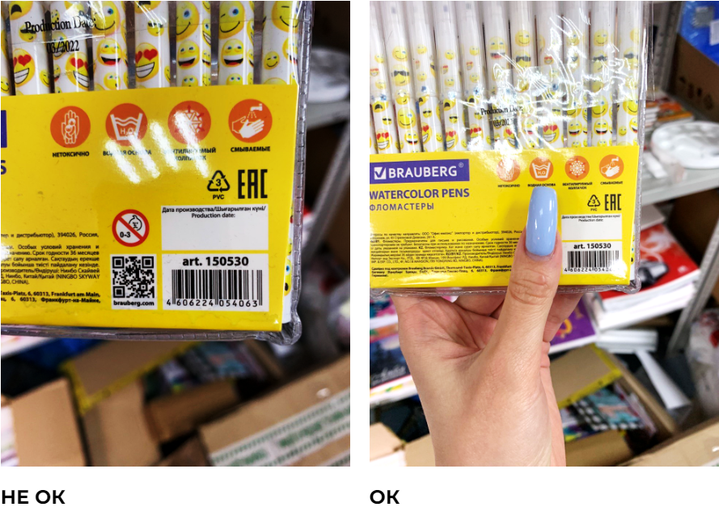
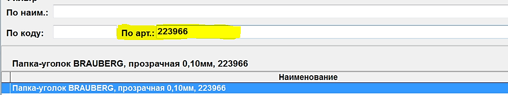
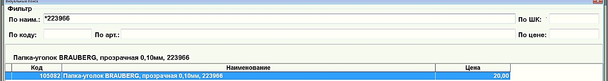

# Работа с кассой

<figure><figcaption></figcaption></figure>

## Общие правила поиска товара по кассе

1. **ЗАКРЫВАТЬ** другие штрих и QR-кода при сканировании, иначе сканер ничего не найдет.

<figure><figcaption></figcaption></figure>

2. Если вы попробовали пробить штрихкод, но ничего не вышло, то ищем по артикулу:&#x20;

<figure><figcaption></figcaption></figure>

3. Если снова не выходит, то Звездочка+артикул пишем в строке "По наим."&#x20;

<figure><figcaption></figcaption></figure>
