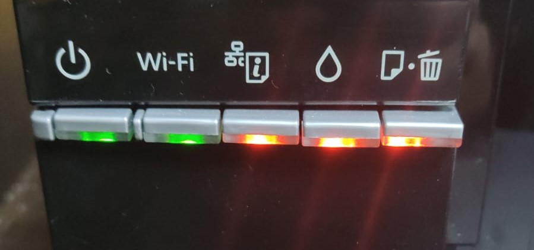

# Общая ошибка - сбой.

Если на вашем принтере загорелись все кнопки, необходимо проделать несколько шагов:

1. Отключить кабель питания&#x20;
2. Достать зажеванный лист,если ничего нет пропустить
3. Включить принтер

Если же,эти шаги не помогли,нужно обратится к мастеру по ремонту принтеров.&#x20;

<figure><figcaption></figcaption></figure>
