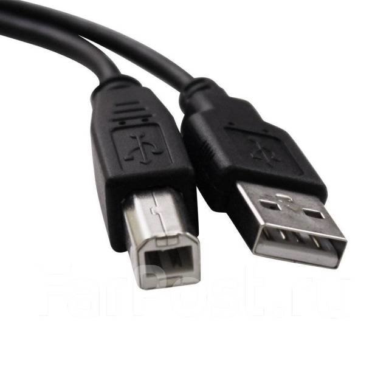

# Подключение принтера

В вашем магазине присутсвует 2 вида подключения принтера:

1. Сетевой кабель&#x20;

<figure><figcaption></figcaption></figure>

2. USB Кабель&#x20;

<figure><figcaption></figcaption></figure>

Инструкция для подключения принтеров по Сетевому кабелю,предоставлена ниже, по USB - кабелю подключение происходит легче, нужно изменить **"Наименование"** и во вкладке **"Доступ"**  - поставить галочку **"Общий доступ к данному принтеру".**  Для подключения на другом компьютере,нужно перейти стандартную процедуру подключения.&#x20;
