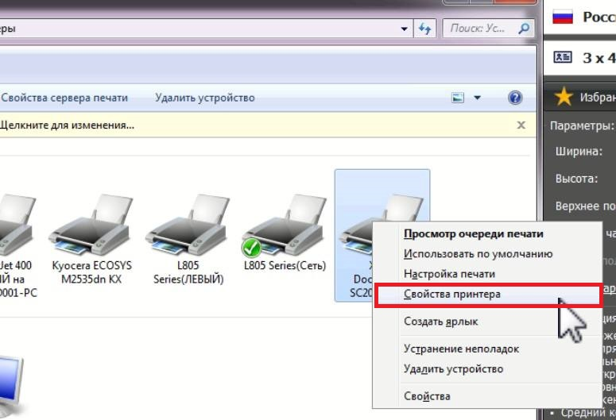

# Двусторонняя печать Xerox

Для включения режима двусторонней печати, нужно сначала перейти в **"Устройство и принтеры"**&#x20;

Найти Xerox DocuCentre SC2020 и нажать по нему правой кнопкой мыши - выбрать из списка **"свойства принтера"** - выбрать вкладку **Конфигурация** "Configurate" - Выбрать **"Устанавливаемые опции"** - Выбрать Элемент: **Дуплекс блок** - перевести в режим "**Установлено"**  и  **Применить настройки.**&#x20;

**Пример:**

<figure><figcaption></figcaption></figure>

<figure><figcaption></figcaption></figure>

