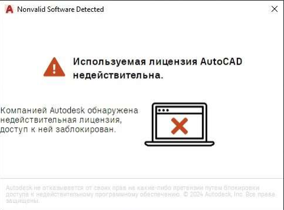
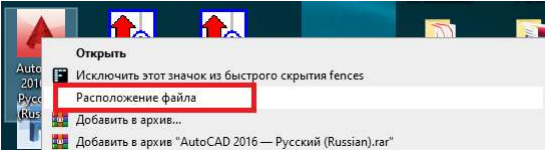
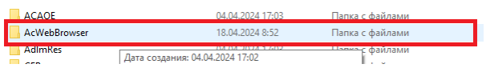
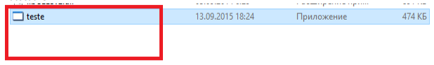

# Используемая лицензия AutoCAD недействительна

<figure><figcaption></figcaption></figure>

1. Находим файл автокада и нажимаем **ПРАВУЮ** кнопку мыши, в появившимся окне выбираем пункт “Расположение файла”.

<figure><figcaption></figcaption></figure>

2. Открываем папку AcWebBrowser

<figure><figcaption></figcaption></figure>

4. Переименовываем файл AcWebBrowser в teste и радуемся тому, что обошли блокировку Autocad

<figure><figcaption></figcaption></figure>
